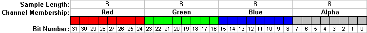
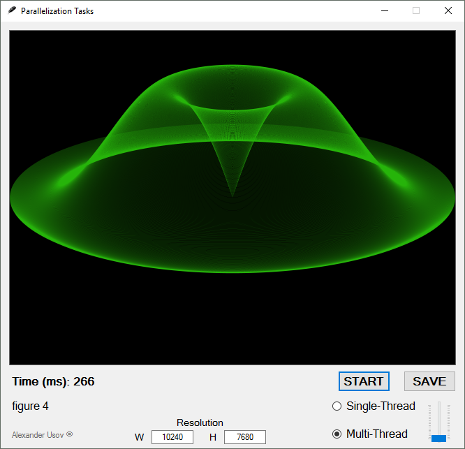
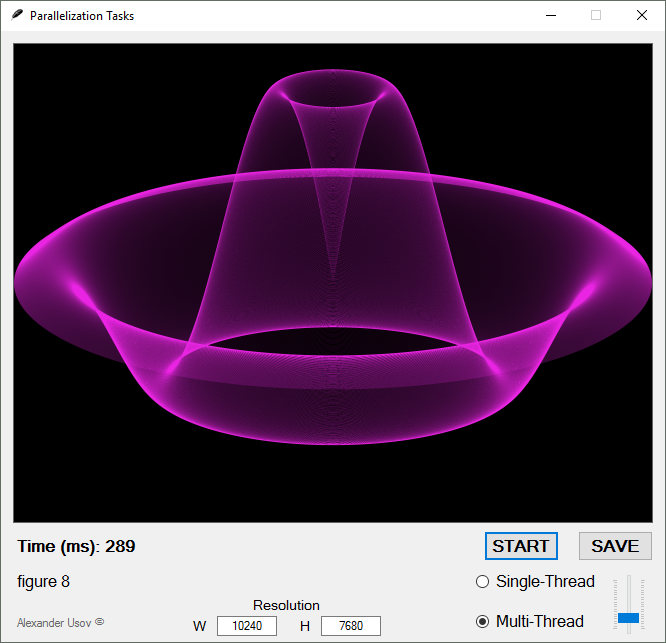

## Pixel format


## 24-битный формат пикселов (24bpp)


поддерживает 16 777 216 различных цветов и сохраняет 1 пиксельное значение в 3 байтах.

Каждый пиксел определяют красный, зеленый и синий образцы пикселя:

```

8.8.8. 0. 0 в нотации RGB A X

```


В порядке: синий, зеленый и красный (8 бит на каждый образец).



## 
Размер строки данных в изображении BMP(8/16/24bpp) должнен быть кратен 4 байтам, иначе строка дополняется нулями.

Пример (изображение шириной в 3 пикселя 24bpp):
```
Длина строки 24 * 3 = 72 / 8 = 9 байт не кратно 4! поэтому добавляется 3 байта и будет равна 12 байтам.
```
## 
## 
## Тестовое приложение Parallelization Tasks





